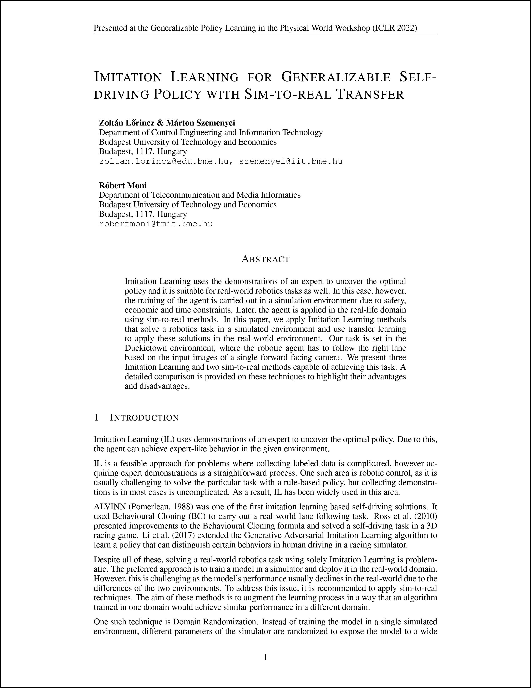

# Imitation Learning in Duckietown

This repository contains the source code of our paper:

| <a href="https://openreview.net/forum?id=rE3OCN6Vk-c"></a> | [*Imitation Learning for Generalizable Self-driving Policy with Sim-to-real Transfer*](https://openreview.net/forum?id=rE3OCN6Vk-c) <br/>Zoltán Lőrincz, Márton Szemenyei, Robert Moni <br/>ICLR 2022 Workshop on Generalizable Policy Learning in Physical World|
| ------ | ------ |


## Video demonstration
This video demonstrates our agent in the Simulated environment:

  

## Setup

To run the experiments included in this repository, the instalation of the dependencies is required. 
This is supported by a Conda environment. 

**The process of setting up the environment is described below:**

First, clone the repository:
```
git clone https://github.com/lzoltan35/duckietown_imitation_learning.git
cd duckietown_imitation_learning
```

Next, run the `create_conda_environment.sh` shell script. This creates the Conda environment with the correct packages, downloads the Duckietown environment and copies our custom maps files to the installed Duckietown packages. The created Conda environment will be called `duckietown`.

```
bash create_conda_environment.sh
```

Activate this Conda environment using (this is required before running any experiments):
```
conda activate duckietown
```

## Training the algorithms

### **Behavioral Cloning, DAgger and GAIL pretraining with BC:**

The training procedure of BC, DAgger and GAIL pretraining (with BC) algorithms consists of 2 steps:
1. The expert is rolled out in the environment to collect demonstrations - training data.
2. The model is trained from the collected data.

The demonstrations can be collected by running `log.py`. 
The script expects the name of the chosen algorithm as a parameter.

```
python3 -m experiments.log {bc | dagger | gail_pretrain}
```
The demonstrations will be stored in `_train.log` file.


After the demonstrations are collected, the algorithm can by trained by running `train.py`. 
The script expects the name of the chosen algorithm as a parameter.

```
python3 -m experiments.train {bc | dagger | gail_pretrain}
```
During the GAIL training, the collected demonstrations will be passed through a feature extractor model and saved in `_features.log` file.
The model will be trained from the extracted features.

The trained models will be stored in these folders:
- BC, DAgger: `trained_models/dpl/`
- GAIL: `trained_models/gail/`


**Note:** 

Before training a new model from scratch, make sure to delete the previously created `_train.log` and model files.
<br>

### **GAIL:**

To train the GAIL algorithm, run `train_gail.py:
```
python3 -m experiments.train_gail
```
If the `LOAD_PRETRAINED_GENERATOR` is set to True, the training script will use the pretrained policy network.

The trained models will be stored at `trained_models/gail/`.
<br>

### **VDA-UNIT:**

The training procedure of the complete UNIT controller framework is the following:

1. The UNIT network is trained (This network performs the image-to-image translation between simulated and real images).
2. The expert is rolled out in the environment to collect demonstrations. The observations are converted to the latent space using the sim-to-latent encoder of the UNIT network. This serves as the training data for the controller network.
3. The controller network is trained from the collected data.

**Prerequisites:**

Before training the image-to-image translation network, the training database has to be created by running:
```
python3 -m utils.create_unit_training_data.py
```

To train the UNIT image-to-image translation network, run `train_unit_network.py`:
```
python3 -m experiments.train_unit_network.py
```

The trained models will be stored at `trained_models/unit/`.

After the UNIT network is properly trained, demonstrations for the controller network can be collected by running `log.py` with `unit_controller` parameter:
```
python3 -m experiments.log unit_controller
```

The demonstrations will be stored in `_unit_train.log` file.

After the demonstrations are collected, the controller network can by trained by running `train.py` with `unit_controller` parameter:

```
python3 -m experiments.train unit_controller
```
The trained models will be stored at `trained_models/unit_controller/`.

## Testing

The trained models can be tested by running `test.py`. The script expects the name of the chosen algorithm as a parameter.
The script rolls out the model in the simulator environment.

```
python3 -m experiments.test {bc | dagger | gail | unit_controller}
```

The image-to-image translation quality of the UNIT network can be observed by running `test_unit_img2img.py`:
```
python3 -m experiments.test_unit_img2img.py
```
The images will be saved to the `unit_img2img/` directory.

## Evaluation

The trained models can be evaluated with the custom Duckietown evaluator tool by running `eval.py`.
The script expects the name of the chosen algorithm as a parameter.

```
python3 -m experiments.eval {bc | dagger | gail | baseline_dagger}
```
The results can be found in the `evaluation_results/` folder.

### DAgger baseline

The training procedure of the official Duckietown DAgger baseline is described <a href="https://github.com/duckietown/gym-duckietown/tree/daffy/learning/imitation/iil-dagger">here</a>.

	
In order to evaluate the baseline, the trained model file (`model.pt`) has to be copied to the following directory: `trained_models/dagger_baseline/`.
After this, the evaluation can be run using the procedure described above.


## Copyright
The custom Duckietown evaluator tool was created based on the <a href="https://github.com/kaland313/Duckietown-RL/blob/master/duckietown_utils/duckietown_world_evaluator.py">implementation of András Kalapos</a>.

The implementation of our GAIL network was created based on the following <a href="https://github.com/Khrylx/PyTorch-RL">repository</a>.

The implementation of our UNIT network was created based on the following <a href="https://github.com/eriklindernoren/PyTorch-GAN#unit">repository</a>.
